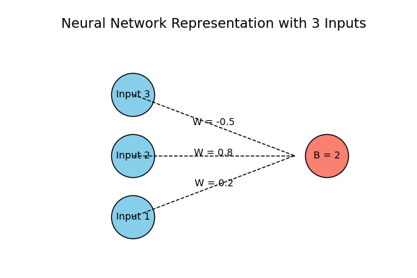

# First Neuron

### Create Random Inputs:
We have a single neuron with three inputs. In most cases, weights in neural networks are initialized randomly, while biases are set to zero. The inputs can either be training data or outputs from previous neurons. For this example, we will use arbitrary values as inputs.

```
	inputs := []float32{1, 2, 3}
```

### Create Random Weights:
Each input is associated with a weight. Inputs represent the data fed into the model, while weights are parameters that are adjusted during training to achieve the desired output. Weights, along with biases, are essential for training the model effectively. In this example, we will assign weights as follows: the first input (1) has a weight of 0.2, the second input has a weight of 0.8, and the third input has a weight of -0.5. This gives us the following input and weight lists:

```
    inputs := []float32{1, 2, 3}
	weights := []float32{0.2, 0.8, -0.5}
```
### Create Random Bias:
Next, we need a bias. Since we are modeling a single neuron with three inputs, there is only one bias value. Unlike weights, the bias is not tied to any specific input but is an additional tunable parameter. For this example, we will set the bias to 2.

```
    inputs := []float32{1, 2, 3}
	weights := []float32{0.2, 0.8, -0.5}
	var bias float32 = 2
```

Such that our NN will look something like:



```
Input      Weights      Weighted Sum   
  [1] ----------- (0.2)             
  [2] ----------- (0.8) ------> Σ(inputs * weights) + bias = Output
  [3] ----------- (-0.5)             
                                     + bias (2)
```

### Output calculation
The neuron sums each input multiplied by its corresponding weight, then adds the bias. Essentially, it calculates the weighted sum of the inputs, where these weights are adjustable parameters, and adds another parameter — the bias — to produce the final output.

The output can be calculated as follows:

$$
\
\text{output} = \left( \text{inputs}[0] \times \text{weights}[0] + \text{inputs}[1] \times \text{weights}[1] + \text{inputs}[2] \times \text{weights}{2} \right)
\
$$

$$
\
\text{output} += \text{bias}
\
$$
<br>

$$
\text{output} = \left( 1 \times 0.2 + 2 \times 0.8 + 3 \times (-0.5) \right)
$$

$$
\text{output} += 2
$$

### Example Code
So our code would look something like:
``` go
    output := (inputs[0]*weights[0]+
            inputs[1]*weights[1]+
            inputs[2]*weights[2])

    output += bias

```

Let's run this code to see the output:


```go
>>> 2.3000002
```

You can visualize the entire process here:


https://nnfs.io/bkr/