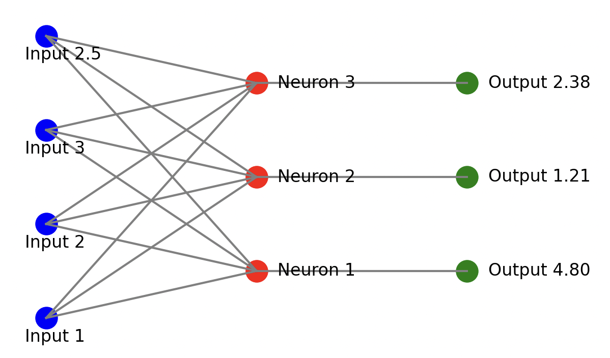

# First Neuron

### Create Random Inputs:
We have a single neuron with three inputs. In most cases, weights in neural networks are initialized randomly, while biases are set to zero. The inputs can either be training data or outputs from previous neurons. For this example, we will use arbitrary values as inputs.

```
	inputs := []float32{1, 2, 3}
```

### Create Random Weights:
Each input is associated with a weight. Inputs represent the data fed into the model, while weights are parameters that are adjusted during training to achieve the desired output. Weights, along with biases, are essential for training the model effectively. In this example, we will assign weights as follows: the first input (1) has a weight of 0.2, the second input has a weight of 0.8, and the third input has a weight of -0.5. This gives us the following input and weight lists:

```
    inputs := []float32{1, 2, 3}
	weights := []float32{0.2, 0.8, -0.5}
```
### Create Random Bias:
Next, we need a bias. Since we are modeling a single neuron with three inputs, there is only one bias value. Unlike weights, the bias is not tied to any specific input but is an additional tunable parameter. For this example, we will set the bias to 2.

```
    inputs := []float32{1, 2, 3}
	weights := []float32{0.2, 0.8, -0.5}
	var bias float32 = 2
```

Such that our NN will look something like:

<center>

</center>

```
Input      Weights      Weighted Sum   
  [1] ----------- (0.2)             
  [2] ----------- (0.8) ------> Σ(inputs * weights) + bias = Output
  [3] ----------- (-0.5)             
                                     + bias (2)
```

### Output calculation
The neuron sums each input multiplied by its corresponding weight, then adds the bias. Essentially, it calculates the weighted sum of the inputs, where these weights are adjustable parameters, and adds another parameter — the bias — to produce the final output.

The output can be calculated as follows:

$$
\
\text{output} = \left( \text{inputs}[0] \times \text{weights}[0] + \text{inputs}[1] \times \text{weights}[1] + \text{inputs}[2] \times \text{weights}{2} \right)
\
$$

$$
\
\text{output} += \text{bias}
\
$$
<br>

$$
\text{output} = \left( 1 \times 0.2 + 2 \times 0.8 + 3 \times (-0.5) \right)
$$

$$
\text{output} += 2
$$

### Example Code
So our code would look something like:
``` go
    output := (inputs[0]*weights[0]+
            inputs[1]*weights[1]+
            inputs[2]*weights[2])

    output += bias

```

Let's run this code to see the output:


```go
>>> 2.3000002
```

You can visualize the entire process here:


https://nnfs.io/bkr/


### Add input

If we now have 4 inputs instead of 3, we need to adjust the input list to include this additional input, and also add a corresponding weight. Each input has an associated weight, so for the new input, we'll create a new weight. Here's how the changes would look like:


$$
\text{output} = \left( 1 \times 0.2 + 2 \times 0.8 + 3 \times (-0.5) + 2.5 \times 1.0 \right)
$$


All together, our code would look something like this

``` go

    inputs := []float32{1, 2, 3, 2.5}
	weights := []float32{0.2, 0.8, -0.5, 1.0}
	var bias float32 = 2

	output := (inputs[0]*weights[0] +
		inputs[1]*weights[1] +
		inputs[2]*weights[2] +
		inputs[3]*weights[3])

	output += bias

	fmt.Println(output)
```

```go
>>> 4.8
```

And finally we can visualize it as:

<center>

</center>


https://nnfs.io/djp/


#### Pretty basic right? Just wait for it
<br>

### A Layer of Neurons

In neural networks, layers are made up of multiple neurons working together. Each neuron in a layer receives the same input, which could be either the initial training data or the output from a previous layer. However, each neuron has its own distinct set of weights and bias, leading to a unique output for each one. The final output of the layer is a collection of the outputs from all its neurons, with one result per neuron. For example, imagine a layer with 3 neurons and 4 inputs.

<center>

</center>

We will continue using the same 4 inputs and sets of weights for the first neuron as before. To expand the layer, we'll introduce 2 additional sets of weights and biases for the new neurons, making a total of 3 neurons in the layer. Each neuron will have its own unique set of weights and biases, and the final output from this layer will be a list containing 3 final values, one for each neuron, rather than a single output like we had when we made just one neuron. This list represents the combined outputs from all the neurons in the layer.

Lets see the code and for the moment we're going to skip the equation since it would only confuse us more.


``` go

package main

import "fmt"

func main() {
	inputs := []float32{1, 2, 3, 2.5}

	weights1 := []float32{0.2, 0.8, -0.5, 1.0}
	weights2 := []float32{0.5, -0.91, 0.26, -0.5}
	weights3 := []float32{-0.26, -0.27, 0.17, 0.87}

	var bias1 float32 = 2
	var bias2 float32 = 3
	var bias3 float32 = 0.5
```

### First output
$$
\text{output}_1 = (1 \times 0.2) + (2 \times 0.8) + (3 \times (-0.5)) + (2.5 \times 1.0) + 2
$$

```go
	output1 := (
		inputs[0]*weights1[0] +
		inputs[1]*weights1[1] +
		inputs[2]*weights1[2] +
		inputs[3]*weights1[3] + bias1)
```

### Second output
$$
\text{output}_2 = (1 \times 0.5) + (2 \times (-0.91)) + (3 \times 0.26) + (2.5 \times (-0.5)) + 3
$$

```go

	output2 := (
		inputs[0]*weights2[0] +
		inputs[1]*weights2[1] +
		inputs[2]*weights2[2] +
		inputs[3]*weights2[3] + bias2)
```

### Third output
$$
\text{output}_3 = (1 \times (-0.26)) + (2 \times (-0.27)) + (3 \times 0.17) + (2.5 \times 0.87) + 0.5
$$


```go

	output3 := (
		inputs[0]*weights3[0] +
		inputs[1]*weights3[1] +
		inputs[2]*weights3[2] +
		inputs[3]*weights3[3] + bias3)


```
### Results
Then we can see all these 3 results as a list:

```go
    finalOutput := []float32{output1, output2, output3}

	fmt.Println(finalOutput)
```

```
>>> [4.8 1.2099999 2.385]
```

<center>

</center>


https://nnfs.io/mxo/

### Standarizing the code

In this code, we have three sets of weights and three biases, defining three neurons. Each neuron is "connected" to the same inputs, but the distinction lies in the individual weights and bias that each neuron applies to the input. This structure is referred to as a fully connected neural network, where every neuron in the current layer has connections to every neuron in the previous layer. While this is a common type of neural network, it's worth noting that there is no strict requirement for everything to be fully connected in this manner. So far, we have only demonstrated code for a single layer with a limited number of neurons. Visualizing code for many more layers and neurons would quickly become complex using our current approach. Instead, we could implement a loop to scale and manage dynamically sized inputs and layers. We’ve converted the individual weight variables into a list of weights, allowing us to iterate over them, and we modified the code to use loops instead of hardcoded operations.

``` go
package main

import "fmt"

func main() {
	// Define the inputs to the neurons
	inputs := []float32{1, 2, 3, 2.5}

	// Define weights for each neuron, with each inner slice representing the weights for one neuron
	weights := [][]float32{
		{0.2, 0.8, -0.5, 1.0},   // Weights for Neuron 1
		{0.5, -0.91, 0.26, -0.5}, // Weights for Neuron 2
		{-0.26, -0.27, 0.17, 0.87}, // Weights for Neuron 3
	}

	// Define biases for each neuron
	biases := []float32{2, 3, 0.5}

	// Create a slice to hold the outputs from each neuron
	outputs := make([]float32, 3)

	// Iterate over each set of weights (and corresponding bias) for the neurons
	for i := range weights {
		// Get the weights and bias for the current neuron
		neuronWeights := weights[i]
		neuronB := biases[i]

		// Initialize the output for the current neuron
		var neuronOut float32

		// Calculate the weighted sum of inputs for the current neuron
		for j := range neuronWeights {
			neuronOut += neuronWeights[j] * inputs[j] // Multiply each weight by its corresponding input and sum
		}

		// Add the bias to the weighted sum
		neuronOut += neuronB

		// Store the output of the current neuron
		outputs[i] = neuronOut
	}

	// Print the outputs from all neurons
	fmt.Println(outputs)
}

```

```
>>> [4.8 1.2099999 2.385]
```

### NICEE!!!

This approach accomplishes the same goal as before but in a more dynamic and scalable manner. If you find any part of the process confusing, feel free to use print() to output the objects and better understand what they are and what’s happening.

So, how do we determine that we have three neurons? The answer lies in the presence of three sets of weights and three biases. When you create your own neural network, you have the freedom to decide how many neurons to include in each layer. You can combine any number of inputs with as many neurons as you wish. As you progress through this book, you'll develop an intuition for the appropriate number of neurons to use. Initially, we'll work with small numbers of neurons to help you grasp the fundamental workings of neural networks.